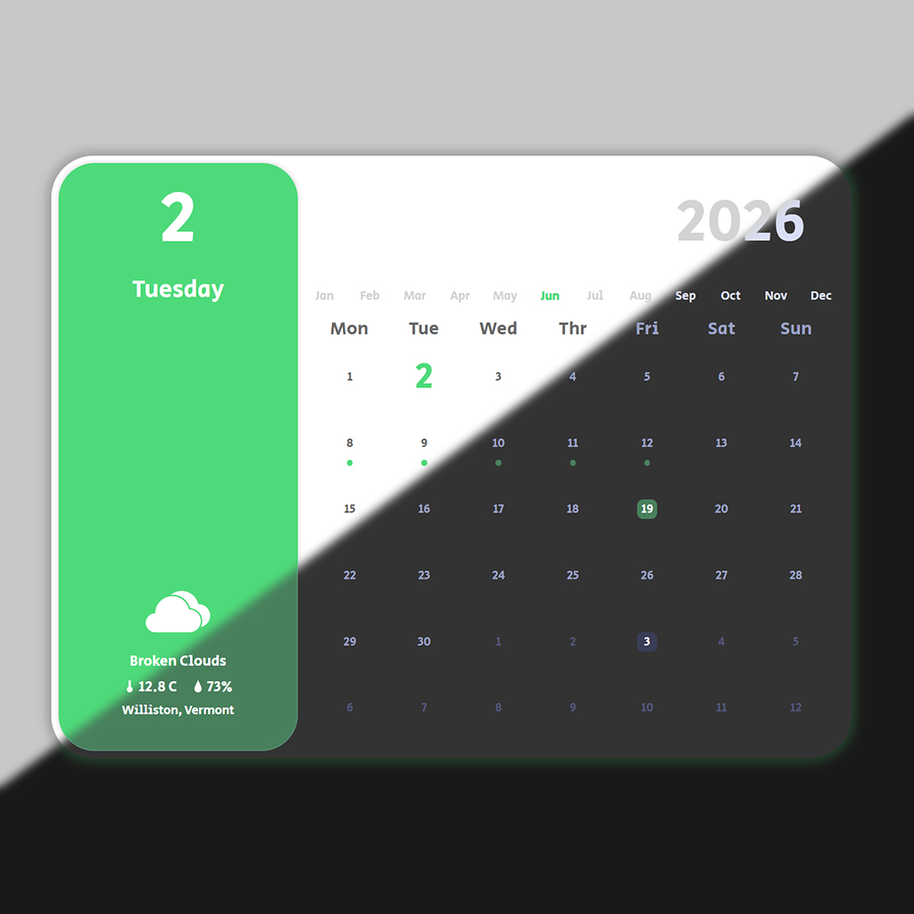

# Memo Calendar

Memo Calendar is an interactive yearly calendar for Wallpaper Engine. It displays calendar dates, memo markers, weather information, and colors synchronized with LocalLink.



## Features

- Yearly calendar display
- Current-day highlighting
- Month selection
- Monday or Sunday as the first day of the week
- Holiday, event, and item memo categories
- Weather and location information from LocalLink
- Automatic light and dark theme synchronization
- Month-based accent colors
- Live updates through LocalLink events

## Requirements

- Wallpaper Engine
- LocalLink running at `http://127.0.0.1:5123`
- An OpenWeather API key configured in LocalLink for weather data

## Installation

1. Keep all files in this directory together.
2. Open Wallpaper Engine and launch the Wallpaper Editor.
3. Import or open `project.json`.
4. Confirm that `Calendar.html` is the project entry file.
5. Start LocalLink before using connected features.

## Configuration

The first day of the week can be changed in Wallpaper Engine's property panel:

- `Monday`
- `Sunday`

Weather units and API settings are managed by LocalLink.

## Memos

Memos are stored and managed by LocalLink:

```text
%LOCALAPPDATA%\LocalLink\memos.json
```

Supported memo types include:

- `holiday`
- `event`
- `item`

The calendar requests entries for the displayed year from:

```http
GET http://127.0.0.1:5123/api/memos?year=2026
```

Do not upload your personal `memos.json` file to GitHub.

## Project Files

```text
Calendar.html   Main wallpaper page
style.css       Layout and visual styling
script.js       Calendar, memo, weather, and LocalLink logic
project.json    Wallpaper Engine project configuration
preview.jpg     Project preview
fonts/          Local fonts
icons/          Weather and interface icons
```

## Troubleshooting

If weather, memos, or theme synchronization do not work:

1. Confirm that LocalLink is running.
2. Open `http://127.0.0.1:5123/api/health` in a browser.
3. Check the OpenWeather API key in LocalLink.
4. Confirm that no security software is blocking the local connection.
