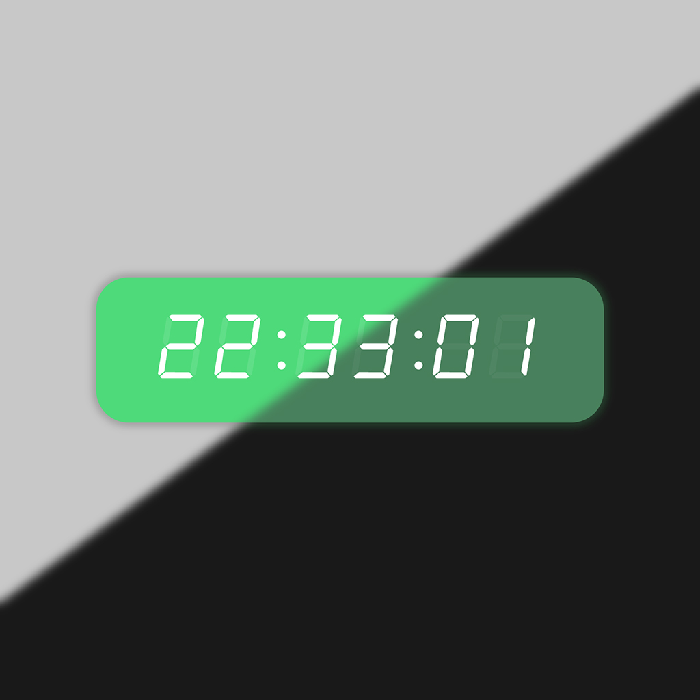

# Digital Clock

Digital Clock is an interactive Wallpaper Engine web wallpaper connected to the LocalLink Windows application.

It displays the current time and automatically follows LocalLink's theme and monthly accent color.



## Features

- Live digital clock updated every second
- Automatic light and dark themes
- Month-based accent colors
- Live LocalLink status updates
- Movable grid-based clock position
- Saved position between sessions
- Custom bundled fonts

## Requirements

- Wallpaper Engine
- LocalLink running at `http://127.0.0.1:5123`

The clock continues to display time without LocalLink, but theme and accent synchronization require the application.

## Installation

1. Keep all files in this directory together.
2. Open Wallpaper Engine and launch the Wallpaper Editor.
3. Import or open `project.json`.
4. Confirm that `Calendar.html` is the project entry file.
5. Start LocalLink to enable synchronization.

Although the entry file is named `Calendar.html`, it belongs to the Digital Clock project.

## Moving the Clock

Triple-click the clock panel to enter placement mode.

Move the pointer to preview a new grid position, then click once to confirm it. The selected position is stored locally and restored the next time the wallpaper starts.

## LocalLink Integration

The clock receives its current theme and accent month from:

```http
GET http://127.0.0.1:5123/api/status
GET http://127.0.0.1:5123/api/events
```

If LocalLink temporarily becomes unavailable, the clock attempts to reconnect automatically.

## Project Files

```text
Calendar.html  Main wallpaper page
style.css      Clock layout and appearance
script.js      Time, positioning, and LocalLink integration
project.json   Wallpaper Engine project configuration
preview.jpg    Project preview
myClock.ttf    Clock display font
square.ttf     Supporting display font
```

## Troubleshooting

If synchronization does not work:

1. Confirm that LocalLink is running.
2. Open `http://127.0.0.1:5123/api/health` in a browser.
3. Restart the wallpaper after LocalLink starts.
4. Confirm that no security software is blocking the local connection.
